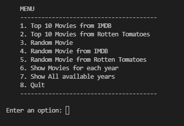
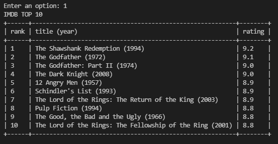
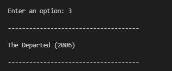
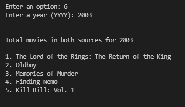
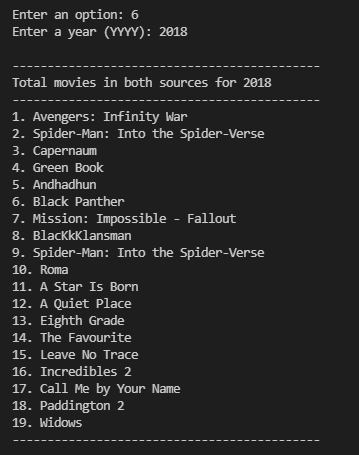

# movies-chart
This CLI app gets the top 250 movies of all time from imdb.com and the top 100 movies from rottentomatoes.com. It displays the top ten from each and generates random movies therefrom.

## Screenshots

